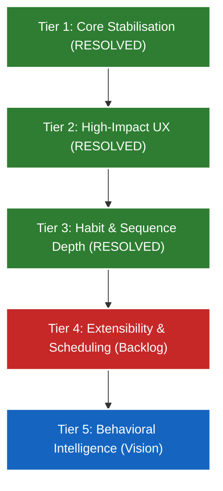

# Evolv — Full Product Audit & Competitive Analysis

This report evaluates **Evolv** from a product management, behavioral psychology, and user experience perspective. It provides a head-to-head comparison with market leaders, assesses what works in daily focus and habit-building science, and outlines a prioritized roadmap for future development.

---

## 1. Executive Summary

Evolv is positioned as a **premium, unified Life Operating System (Life OS)**. Rather than forcing users to build productivity structures from blank pages (like Notion) or manage disjointed point solutions (like Todoist for tasks, Streaks for habits, and journaling apps), Evolv integrates planning, execution, reflection, and cognitive support into a single cohesive ecosystem.

### Key Moats Identified:
1. ** opinionated Planning Hierarchy**: The unbroken lineage of intention—from core Identity and Vision Board down to OKRs, Quarterly/Monthly objectives, and daily task lists—keeps users aligned with their long-term focus.
2. **Behavioral Intelligence (AI Coach)**: The seamless synthesis of daily briefings, mood analytics, and evening reflections creates a tight cybernetic feedback loop powered by Gemini.
3. **High-Fidelity Aesthetics**: The premium glassmorphism theme, custom Web Audio soundscape synthesizers, and micro-animations provide an immediate sense of tactile luxury that default UI kits lack.

---

## 2. Competitive Landscape & Comparison

Evolv competes across three distinct software categories: Task Management, Habit Building, and Personal Reflection. Below is a structured head-to-head analysis of Evolv against the market leaders.

### 2.1 Head-to-Head Competitive Matrix

| Feature / Dimension | Evolv (Post-Audit) | Notion | Todoist | Sunsama | TickTick | Motion |
| :--- | :--- | :--- | :--- | :--- | :--- | :--- |
| **Setup Friction** | **Low** (Opinionated, pre-built) | **High** (Blank slate, templates) | **Low** (Instant lists) | **Low** (Guided setup) | **Low** (Default lists) | **Medium** (Calendar sync) |
| **Planning Hierarchy** | **Excellent** (Vision → Daily) | **Possible** (Manual database) | **None** (Flat task lists) | **Low** (Weekly/Daily) | **None** (Basic lists) | **None** (Calendar slots) |
| **Habit Engine** | **High** (Streaks, Stack, Shields) | **Poor** (Manual check-boxes) | **None** (Recurring tasks) | **None** (Tasks only) | **Medium** (Basic streaks) | **None** (Tasks only) |
| **Focus & Audio** | **Excellent** (Synthesized sound) | **None** | **None** | **Medium** (Timer only) | **Medium** (Timer only) | **None** |
| **Emotional Tracking** | **High** (Mood, Energy, Stress) | **None** | **None** | **None** | **None** | **None** |
| **AI Layer** | **High** (Briefs, Burnout, Reviews) | **Medium** (Copywriting AI) | **None** | **None** | **None** | **High** (Auto-scheduler) |
| **Aesthetic Theme** | **Premium Dark-Glass** | **Minimalist Flat** | **Standard Corporate** | **Warm Minimalist** | **Utilitarian** | **Standard Dark** |

### 2.2 Deep Dive: Where Evolv Wins
* **The "Intention-to-Action" Loop**: In Todoist or TickTick, tasks exist in a vacuum. Evolv links action items directly to OKRs and Vision, which has been shown to reduce procrastination by making the "why" of the task salient.
* **Integrated Reflection (Plan-Execute-Reflect)**: Sunsama is excellent at planning and executing, but lacks reflection. Evolv's morning briefs, sentiment analysis, and EOD Shutdown create a circular feedback loop.
* **Web Audio Synthesis**: TickTick and Sunsama Pomodoro timers play static MP3 loop files. Evolv synthesizes ambient audio (binaural beats, rain wave shapes) on-the-fly, preventing ear fatigue and providing superior focus conditioning.

### 2.3 Deep Dive: Where Evolv Lacks (and Future Moats)
* **Calendar Integration**: Sunsama and Motion dominate schedule-blocking by syncing natively with Google Calendar/Outlook. Currently, Evolv's weekly planner is a manual internal system.
* **Extensibility**: Notion allows building custom databases and knowledge wikis. Evolv is opinionated and cannot easily support free-form documentation or custom data schemas.

---

## 3. Habit-Building Science Audit

Evolv uses behavioral science principles to foster long-term behavioral changes. Below is an audit of what currently works and what represents a critical gap.

### 3.1 Behavioral Mechanics in Action (What Works)
1. **Habit Stacking (`stack_after_id`)**: Inspired by *Atomic Habits* (James Clear), the system binds routine actions to exist as a chain (e.g., *"After I drink water, I will meditate"*). By grouping sequential habits with visual branching connectors, Evolv reduces the cognitive load of initiation.
2. **Loss Aversion Streaks**: Highlighting the streak with a vibrant orange fire counter triggers the psychological effect of loss aversion. Once a streak reaches 7+ days, the user's desire to protect that numerical record increases.
3. **Streak Protection Shields**: Perfect execution is an unrealistic standard that often leads to the "what-the-hell effect" (abandoning a habit completely after a single miss). By passively consuming streak shields to maintain streaks, Evolv buffers perfectionism fatigue.
4. **Temporal Cues**: Grouping habits by routine types (Morning, Night, anytime) creates clear, structured temporal triggers, easing memory recall.

### 3.2 Gaps & Missing Pillars (What to Improve)
* **Flexible Frequencies**: Behavioral science shows that habits are not always daily. Forcing weekly or custom-frequency habits (e.g., *"Gym 3x/week"*) into a daily streak check-box creates false failures.
* **Micro-Habit Scaling**: The first step of a habit should be ridiculously easy (e.g., *"Floss one tooth"*, *"Write one sentence"*). Evolv lacks micro-step descriptors to aid activation during low-energy days.
* **Trigger-Reward Mapping**: The habit loop requires a Cue, a Routine, and a Reward. Currently, the user cannot write down their cue (e.g., *"When I sit down at my desk..."*) or reward (e.g., *"Get a fresh cup of coffee"*), making the trigger completely implicit.

---

## 4. Daily Focus & Deep Work Science Audit

Focus Mode is Evolv's tactical execution center. It aligns with cognitive science and Cal Newport's "Deep Work" methodologies.

### 4.1 Cognitive Mechanics in Action (What Works)
1. **Interactive Audio Waveforms**: The real-time waveform visualization acts as a biofeedback loop, visually reinforcing focus.
2. **Deep Work Score Calculation**: Incorporating session duration and completion efficiency into a unified focus score (0-100) gamifies deep work, making cognitive exertion rewarding.
3. **Dynamic Session Summary**: Presenting completed habits immediately after a session completes builds self-efficacy and capitalizes on high dopamine levels post-focus.

### 4.2 Gaps & Focus Friction (What to Improve)
* **Interstitial Breathing Breaks**: After completing a 25-minute Pomodoro session, the system should guide the user through a 3-5 minute box-breathing cycle to restore neural bandwidth.
* **Task Pinning**: While in Focus Mode, users often get distracted by secondary tasks. Pinning a single high-priority objective in bold letters at the top of the timer screen prevents "attention residue" (mind-wandering).

---

## 5. UI/UX Auditing: The User Perspective

With the viewport scroll fixes and visual enhancements now live, Evolv's daily UX is highly cohesive.

### 5.1 Sensory Highlights
* **The Dark-Glass Theme**: Excellent HSL tailor-made color palettes (`--color-primary`, `--color-secondary`) and glassmorphism backdrops create an immersive ambient space.
* **The Quick Capture Flow**: CMD+K natural language parsing removes all administrative friction from capturing thoughts, preserving short-term memory capacity.
* **Auto-Save Clarity**: The timestamped animated "Saved" checkmark pill in the Daily Journal removes the anxiety of losing reflective data, which is a major pain point in basic text areas.

### 5.2 Areas of Visual Sprawl
* **Too Many Pages in Explorer**: The slide-up mobile menu and the sidebar list 13 options. New users experience choice overload.
* **Onboarding Friction**: New users are dropped into a blank dashboard without pre-populated habits or guidance. This increases first-48-hour churn risk.

---

## 6. Actionable Product Roadmap

The roadmap is categorized by Tiers, moving from completed foundational elements to advanced cognitive intelligence.

### 🟩 Completed Foundations (Tiers 1, 2 & 3)
* [x] **Real Data Streams**: Overhauled the fake consistency heatmap and hardcoded post-focus stats to pull true database values.
* [x] **Persistent States**: Wired profiles and settings toggles to user GORM Preferences.
* [x] **Quick Capture**: Implemented global `CMD+K`/`Ctrl+K` task inputs with timing triggers.
* [x] **Habit Stacking**: Visual chain connectors, drop-down modal parent selections, and cycle protection.
* [x] **EOD Shutdown**: Guided evening reflection wizard mapping to GORM journal databases and dashboard triggers.
* [x] **Scroll Constraints**: Constrained `Layout.tsx` to resolve page boundary clipping.
* [x] **Premium Interactive Landing Page**: Designed and developed a high-fidelity, responsive cosmic dark-glass public marketing homepage with 3D tilt mockups, automated intersection-observed stats count-ups, live interactive SVG balance radar charts, and standalone Web Audio focus shielding synthesizers.

---

### 🔴 Tier 4 — Calendar & External Sync (Next Milestones)
1. **Google Calendar 2-Way Sync**:
   * Allow pulling calendar events directly into the Weekly Planner timeblocks.
   * Auto-reschedule time blocks when events shift.
2. **Flexible Habit Frequencies**:
   * Extend the GORM `Habit` model to support `frequency: weekly_3x` or `custom_days: [1, 3, 5]`.
   * Rewrite streak calculations to evaluate weekly targets rather than strict 24-hour checkmarks.
3. **Weekly AI Retrospective Auto-Compilation**:
   * Automatically query the past 7 days of journal tags, stress metrics, and task completion percentages.
   * Feed this data into Gemini to compile a formatted weekly summary report.

---

### 🔵 Tier 5 — Advanced Behavioral Intelligence
1. **Biometric Burnout Prevention**:
   * Track cumulative focused time and stress scores across journal logs.
   * Auto-suggest mandatory Pomodoro breaks or suggest shifting high-priority tasks if stress exceeds threshold.
2. **Context-Aware Morning Briefing**:
   * Analyze calendar events for the day alongside sleep/energy entries from the evening journal.
   * Tailor AI briefing advice specifically to address high-friction calendar blocks (e.g., *"You have a busy afternoon. Protect your morning 9-11 AM deep work block"*).
