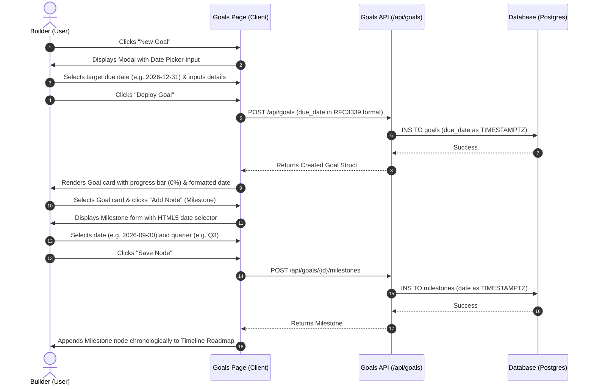
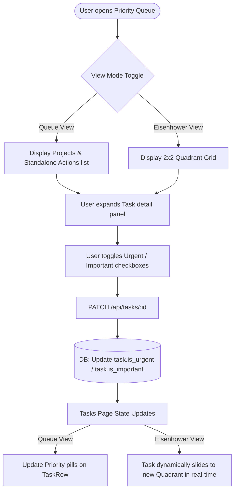
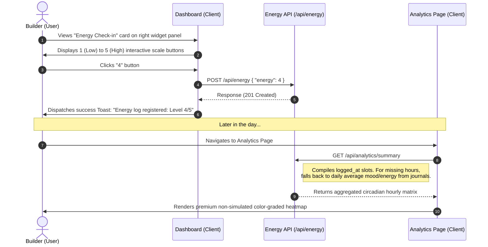

# Application User Flows — Week 9 Gaps & Enhancements

This document maps out the interactive app flows and user journeys introduced for the Week 9 functional enhancements in the Evolv portal.

---

## 1. Strategic Planning Flow (Goals & Milestones)

The user establishes objectives and maps them to a roadmap using concrete date controls:

---

## 2. Priority Queue & Eisenhower Matrix Flow

The builder prioritizes their actions using a toggleable list and 4-quadrant layout:

### 2.1. Task Creation & Progress Propagation Flow
1. **Define Task**: Builder clicks **Add Task** and specifies properties (Title, Project, Parent Task, Dependency, Linkage Goal, Urgency, Importance).
2. **Persistence**: Client calls `POST /api/tasks`.
3. **Database Transaction**:
   - Inserts task record with foreign keys (`goal_id`, `objective_id`) and flags (`is_urgent`, `is_important`).
   - Trigger recalculation function: Computes overall completion percentage of the parent goal from its key results and associated tasks.
   - Atomically updates the `progress` column in the `goals` table.
4. **Reactive Feedback**: The UI updates the goal's progress bar dynamically without requiring a page reload.

---

## 3. Circadian Energy Check-in Flow

The user logs their energy levels to build a real-time circadian battery heatmap:

