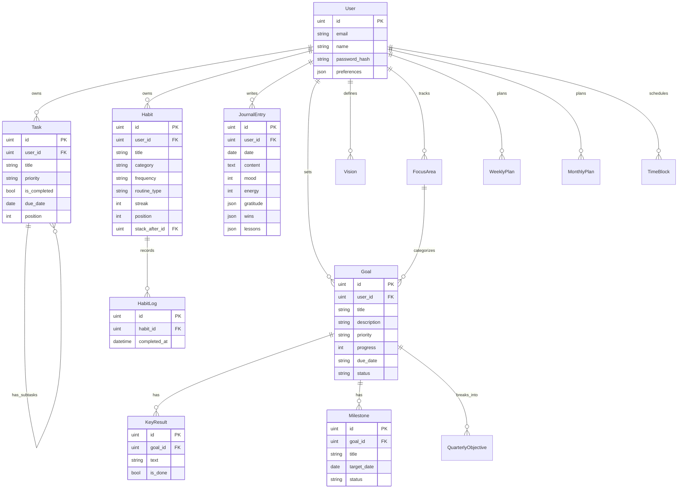

# Evolv — Master Implementation Plan

> **"Turn life goals into executable systems."**
>
> This document defines every phase of development from MVP to full product,
> organized as vertical slices. Each slice is demoable on its own.

---

## Current State (What's Built)

| Layer | Status |
|-------|--------|
| **Golang API** | CRUD for Tasks, Habits, HabitLogs, Journal, Vision. Daily dashboard endpoint. JWT auth. CORS middleware. |
| **React Client** | Full premium UI — Dashboard (Daily Blueprint), TasksPage, HabitsPage, GoalsPage, FocusModePage (live timer), SettingsPage, JournalPage, AnalyticsPage, WeeklyPage, VisionPage, SessionSummaryPage, OnboardingPage, Login/Register. |
| **Database** | PostgreSQL via GORM. Tables: `users`, `tasks`, `habits`, `habit_logs`, `journal_entries`, `visions`. |
| **Infrastructure** | Docker Compose for Postgres. `.env` config. |
| **Theme System** | Full dark/light "Paper & Glass" theme via CSS variables + ThemeContext. |
| **Animation System** | SVG stroke-draw, breathe, wave, fadeUp, glowBurst, celebPop keyframes. prefers-reduced-motion support. |

---

## Tech Stack (Confirmed)

| Concern | Choice |
|---------|--------|
| Frontend | React 19 + TypeScript + Vite + Tailwind CSS v4 |
| Backend | Golang (standard library `net/http` + GORM) |
| Database | PostgreSQL |
| Auth | JWT ✅ |
| AI | OpenAI / Gemini API via Go HTTP client |
| Real-time | WebSockets (Phase 3) |
| Deployment | Docker |

---

## Design System Philosophy

The frontend uses a **"Paper & Glass"** dual-theme design system with full dark/light parity.

### Design Tokens (Implemented)

| Token | Dark Mode | Light Mode |
|-------|-----------|------------|
| Font | Newsreader (display) + Outfit (body/labels) | same |
| Background | `#121319` | `#FDFCFE` |
| Surface | `#1E1F25` | `#FFFFFF` |
| Primary | `#D2BBFF` (cyber-lavender) | `#6C4AB0` |
| Secondary | `#5ADACE` (teal) | `#006A63` |
| Glass panel | `color-mix(surface 60%, transparent)` + `backdrop-blur(20px)` | same |
| Border radius | `rounded-2xl` (cards), `rounded-full` (pills/badges) | same |
| Transitions | `150ms ease` micro · `300ms cubic-bezier(0.22,1,0.36,1)` page | same |

### Interaction Principles (Implemented)

- **`.card-hover`**: `translateY(-2px)` + shadow lift on hover
- **`.press-scale`**: `scale(0.97)` on active press
- **`.glass-panel`**: backdrop-blur glassmorphic surface with themed borders
- **SVG stroke-draw**: Checkmarks and circles animate in on completion (`strokeDraw` keyframe)
- **`.anim-breathe`**: Focus ring pulses gently on 4s cycle
- **`.anim-wave`**: Waveform bars oscillate with staggered delays
- **`.anim-fade-up`**: Staggered entrance for list items
- **`.anim-glow-burst`**: Ring flash on habit completion
- **`.anim-celeb`**: Spring pop for celebration states
- **`@media (prefers-reduced-motion)`**: All animations disabled system-wide

### Layout Structure

```
┌────────────────────────────────────────────────────┐
│ Sidebar (collapsible + theme toggle)  │  Main       │
│ ┌──────────────┐                      │  Content    │
│ │ Evolv Logo   │                      │  Area       │
│ │ Nav Items    │                      │             │
│ │ · Dashboard  │                      │  Page       │
│ │ · Vision     │                      │  Content    │
│ │ · Goals      │                      │             │
│ │ · Weekly     │                      │             │
│ │ · Tasks      │                      │             │
│ │ · Habits     │                      │             │
│ │ · Journal    │                      │             │
│ │ · Analytics  │                      │             │
│ │ · Focus      │                      │             │
│ │ · Settings   │                      │             │
│ └──────────────┘                      │             │
└────────────────────────────────────────────────────┘
Mobile: bottom tab bar (5 primary icons)
```

---

## Phase 1 — Core Execution Engine (MVP)

> **Goal**: A fully functional daily productivity loop that feels premium.
> **Status**: ✅ COMPLETE

### 1.1 — Design System & App Shell ✅

**Frontend:**
- [x] Install `react-router-dom` for client-side routing
- [x] `<Layout>` component with collapsible sidebar navigation
- [x] Glassmorphic `glass-panel` utility (surface + backdrop-blur + themed border)
- [x] `ProgressRing` SVG component (animated, gradient stroke)
- [x] Skeleton shimmer loading states (via `animate-pulse`)
- [x] Smooth page transition — `page-enter` keyframe (fade + slide up)
- [x] Sidebar navigation with Material Symbols icons
- [x] Responsive mobile bottom navigation
- [x] **ThemeContext** — dark/light toggle with localStorage persistence
- [x] `data-theme="light"` attribute system driving all CSS variable overrides
- [x] Sidebar theme toggle button with animated sun/moon icon swap

**Key Screens:**
- App Shell with sidebar navigation ✅
- Responsive layout (desktop + mobile) ✅

---

### 1.2 — Daily Blueprint Dashboard ✅

> Previously "Enhanced Daily Dashboard". Redesigned as the **Daily Blueprint** — a unified chronological timeline merging tasks and habits.

**Frontend:**
- [x] **Daily Blueprint** unified list: Morning habits → Tasks → Anytime habits → Evening habits
- [x] Live SVG progress ring showing overall day completion (%)
- [x] Per-item `BlueprintRow` component: type-aware icon, accent color, streak badge
- [x] SVG stroke-draw completion checkmark with `anim-glow-burst` ring flash
- [x] Completed items fade + strikethrough → collapse into `<details>` summary
- [x] Inline quick-add task form (no modal) with animated entrance
- [x] "Blueprint Complete!" celebration banner when all items done
- [x] Quick Links row (Focus / Journal / Goals / Analytics)
- [x] Morning greeting with time-aware salutation
- [x] "System Active" pulse badge

**Backend:**
- [x] `GET /api/daily` — returns tasks + habits merged for the authenticated user
- [x] `POST /api/tasks` — create task
- [x] `PUT /api/tasks/{id}/complete` — mark complete
- [x] `PATCH /api/tasks/{id}` — update (priority, title)
- [x] `POST /api/habits/{id}/log` — log habit completion

**Key Screens:**
- Daily Blueprint Dashboard ✅

---

### 1.3 — Habit Engine ✅

**Frontend:**
- [x] **Stable seeded heatmap** (30-day consistency bars, no re-render flicker via `Math.sin` seed)
- [x] **SVG stroke-draw circle + checkmark** animation on habit log
- [x] **`anim-glow-burst`** on completion
- [x] **Today's Pulse** card with live completion % bar + top-3 streak leaderboard
- [x] Morning Sequence / Night Sequence / Anytime sections
- [x] Context menu: reassign routine type (morning/night/anytime) + delete
- [x] Staggered `anim-fade-up` list entrance
- [x] Create habit modal with category (5 options) + routine type selector
- [x] Empty state with CTA button

**Backend:**
- [x] `GET /api/habits` — all user habits with `completed_today` flag
- [x] `POST /api/habits` — create (title, category, routine_type, frequency)
- [x] `PATCH /api/habits/{id}` — update routine_type
- [x] `POST /api/habits/{id}/log` — log completion
- [x] `DELETE /api/habits/{id}` — delete habit
- [x] `GET /api/habits/{id}/stats` — streak history + completion %

**Key Screens:**
- Habit Engine ✅

---

### 1.4 — Authentication & User Management ✅

**Frontend:**
- [x] Login / Register pages with glassmorphic design
- [x] JWT token storage + auto-logout on 401
- [x] Protected route wrapper
- [x] OnboardingPage (3-step wizard: name → focus areas → primary goal)
- [x] Settings page with identity, appearance, sensory controls, and ecosystem toggles

**Backend:**
- [x] `User` model (email, password_hash, name, preferences JSON)
- [x] `POST /api/auth/register` — create user with hashed password
- [x] `POST /api/auth/login` — return JWT
- [x] JWT middleware — protect all `/api/*` routes
- [x] `user_id` FK on Task, Habit, HabitLog — all queries scoped per user

**Key Screens:**
- Login / Register ✅
- Onboarding Wizard (3 steps) ✅
- Settings / Configuration ✅

---

### 1.5 — Journaling & Reflection ✅

**Frontend:**
- [x] JournalPage with mood selector (Focused / Calm / Stressed) with color-coded active states
- [x] Cognitive energy slider with animated fill track and thumb
- [x] **Gratitude / Wins / Lessons** `ChipList` — interactive tag editor, auto-saves on change
- [x] **Prompt chips** — inject writing prompts directly into textarea
- [x] **Today / History** view toggle
- [x] **History view** — fetches `GET /api/journal`, shows past entries as cards with mood badge + energy %
- [x] Debounced auto-save (1.2s) on textarea change
- [x] Immediate save on mood/energy/chip change
- [x] AI Coach bar (UI) at bottom of write view
- [x] Live save status indicator (spinner / timestamp)

**Backend:**
- [x] `JournalEntry` model (user_id, date, content, mood, energy, gratitude[], wins[], lessons[])
- [x] `POST /api/journal` — create entry
- [x] `GET /api/journal` — list entries
- [x] `GET /api/journal/{date}` — get by date
- [x] `PATCH /api/journal/{id}` — update entry

**Key Screens:**
- Daily Journal Page ✅
- Journal History ✅

---

### 1.6 — Task Manager ✅

> Rebuilt from static mockup to fully live API-wired task management.

**Frontend:**
- [x] Live task list from `fetchDashboard`
- [x] Inline add with priority selector (High / Medium / Low)
- [x] Complete task (SVG stroke-draw checkmark), delete task, change priority
- [x] Filter tabs (Pending / Done / All) with live counts
- [x] Expandable task rows — inline priority editor
- [x] Progress bar across top
- [x] Staggered `anim-fade-up` entrance per row
- [x] "Focus Mode" shortcut button in header
- [x] Empty states per filter

**Backend:**
- [x] `GET /api/tasks` — all tasks (via dashboard)
- [x] `POST /api/tasks` — create (title, priority)
- [x] `PUT /api/tasks/{id}/complete` — mark complete
- [x] `PATCH /api/tasks/{id}` — update priority
- [x] `DELETE /api/tasks/{id}` — delete

**Key Screens:**
- Priority Queue (Tasks) ✅

---

## Phase 1.x — UX Polish & Animation Layer ✅

> Completed as a dedicated UX audit pass after Phase 1 MVP.

### Light / Dark Theme System ✅

- [x] Full "Paper & Glass" light theme via `[data-theme='light']` CSS overrides
- [x] Fixed `index.html` hardcoded `dark bg-[#0A0510]` body class (was blocking light mode)
- [x] All pages audited and migrated from hardcoded hex values to CSS variables:
  - `DashboardPage`, `HabitsPage`, `TasksPage`, `FocusModePage`, `VisionPage`
  - `GoalsPage`, `JournalPage`, `AnalyticsPage`, `WeeklyPage`, `SessionSummaryPage`
  - `SettingsPage`, `OnboardingPage`, `LoginPage`, `RegisterPage`, `Sidebar`
- [x] Smooth `transition: background-color 0.3s ease` on body
- [x] System `prefers-color-scheme` detection as default theme

### Animation System ✅

New keyframes added to `index.css`:

| Keyframe | Usage |
|----------|-------|
| `strokeDraw` | SVG checkmark/circle path draws on completion |
| `glowBurst` | Ring expands + fades on habit/task complete |
| `fadeUp` | Staggered list item entrance |
| `breathe` | Focus ring orb pulses at 4s interval |
| `wave` | Waveform bars oscillate with staggered delays |
| `tickPulse` | Timer counter subtly scales each second |
| `celebPop` | Spring-pop for celebration states |
| `progressFill` | Progress bar animates from 0% on mount |

All animations respect `@media (prefers-reduced-motion: reduce)`.

### Focus Mode — Live Timer ✅

- [x] Live countdown timer with `setInterval`
- [x] Preset durations (25 / 45 / 90 min) + custom input
- [x] SVG gradient progress ring (arc advances in real time)
- [x] Play / Pause / Reset controls
- [x] **`anim-breathe`** glow orb behind ring when running
- [x] **`anim-tick`** subtle timer pulse each second
- [x] Animated waveform (12 bars oscillating when running, grey when paused)
- [x] Session complete state: SVG stroke-draw checkmark + `anim-celeb`
- [x] Ambient sound selector (Rain / Binaural / White Noise / Forest)

### Settings — Sensory Controls ✅

- [x] **Identity** section (avatar, name, email)
- [x] **Appearance** section: live theme toggle card + accent color swatches
- [x] **Sensory Controls** section with 5 toggles:
  - Ambient Orbs, Page Transitions, Habit Glow, Timer Pulse, Waveform Visualizer
- [x] Interactive toggle pill with animated knob + glow when active
- [x] **Environment Matrix**: timezone + week start selectors
- [x] **Ecosystem Nodes**: 4 integration toggles
- [x] Commit Changes button with green success state feedback

### Goals Page ✅

- [x] OKR cards with mini SVG progress ring per goal
- [x] Key result toggle with stroke-draw checkmark; auto-recalculates progress %
- [x] Inline goal creation form (title, description, due date, priority, key results)
- [x] Goal deletion
- [x] Summary row (Active Goals / Avg Progress / High Priority)
- [x] Milestone Roadmap with `done` / `active` / `upcoming` node states
- [x] Staggered `anim-fade-up` on all cards

---

## Phase 2 — Planning Hierarchy

> **Goal**: Build the vision → yearly → quarterly → monthly → weekly cascade.
> **Timeline**: ~4-5 weeks

### 2.1 — Vision Layer ✅ COMPLETE

**Frontend:**
- [x] Vision Board page:
  - Personal Mission Statement (editable rich text)
  - Core Values (draggable card grid, max 5)
  - Life Wheel / Radar Chart (interactive SVG — rate each area 1-10)
  - Focus Areas with icons (Health, Career, Wealth, etc.)
  - "Future Self" free-write section
  - Bucket List (checklist with categories)

**Backend:**
- [x] `Vision` model (user_id, mission, values[], future_self_text)
- [x] `FocusArea` model (user_id, name, icon, current_score, target_score)
- [x] `BucketListItem` model (user_id, title, category, is_completed)
- [x] CRUD endpoints for each

**Key Screens:**
- Vision Board (radar chart + values + mission)

---

### 2.2 — Goals Backend ✅

> GoalsPage UI is complete and wired.

**Backend:**
- [x] `Goal` model (user_id, title, description, priority, due_date, progress, status)
- [x] `KeyResult` model (goal_id, text, is_done)
- [x] `Milestone` model (goal_id, title, target_date, status)
- [x] `POST /api/goals` — create goal with key results
- [x] `GET /api/goals` — list all user goals
- [x] `PATCH /api/goals/{id}` — update title, description, priority
- [x] `DELETE /api/goals/{id}` — delete goal
- [x] `PATCH /api/goals/{goalID}/key-results/{krID}/toggle` — toggle key result done
- [x] Progress is auto-calculated on key result toggle

---

### 2.3 — Quarterly Planning ✅

**Frontend:**
- [x] Quarterly view with objectives linked to yearly goals
- [x] Quarter navigation (Q1/Q2/Q3/Q4 tabs)
- [x] Quarterly Scorecard

**Backend:**
- [x] `QuarterlyObjective` model (user_id, goal_id, quarter, year, title, outcome, status)
- [x] `GET /api/quarterly/{year}/{quarter}/scorecard`

---

### 2.4 — Monthly Planning ✅

**Frontend:**
- [x] Monthly planner with focus theme
- [x] Radar chart life score snapshot
- [x] Habit targets

**Backend:**
- [x] `MonthlyPlan` model (user_id, month, year, theme, goals[], life_scores JSON)
- [x] `GET /api/monthly/{year}/{month}/life-score`

---

### 2.5 — Weekly Planning System ✅

**Frontend:**
- [x] 7-column week grid with time blocks
- [x] Weekly MITs (top 3-5 tasks)
- [x] Eisenhower Matrix overlay
- [x] Weekly Review template

**Backend:**
- [x] `WeeklyPlan` model
- [x] `TimeBlock` model
- [x] `GET /api/weekly/{date}/overview`

---

## Phase 3 — AI Intelligence

> **Goal**: Make the AI the product's biggest differentiator.
> **Timeline**: ~3-4 weeks

### 3.1 — AI Planning Assistant ✅
- [x] AI Chat panel (slide-in from right)
- [x] "Break down this goal" button on Goal cards
- [x] Goal → Quarterly → Monthly → Weekly cascade generator
- [x] `POST /api/ai/break-down-goal`
- [x] `POST /api/ai/generate-weekly-plan`
- [x] `POST /api/ai/chat`

### 3.2 — AI Daily Coach ✅
- [x] Morning briefing card (AI-generated)
- [x] Evening reflection prompt (contextual)
- [x] AI insight cards on Dashboard
- [x] `POST /api/ai/morning-brief`
- [x] `GET /api/ai/insights`

### 3.3 — AI Reflection Engine ✅ COMPLETE
- [x] Journal entry sentiment analysis + theme extraction
- [x] Burnout risk indicator (green/yellow/red)
- [x] Auto-generated weekly/monthly review summaries

---

## Phase 4 — Analytics & Emotional Intelligence

> **Goal**: Beautiful analytics that feel motivating, not overwhelming.

### 4.1 — Analytics Dashboard ✅

> UI complete and wired to backend endpoints.

**Frontend:**
- [x] Analytics page with premium chart components:
  - Productivity trend line (bar chart)
  - Time allocation (progress bars)
  - AI correlations (UI only for now)
- [x] Wire to real backend analytics endpoints
- [ ] Date range selector (7d / 30d / 90d / 1y)
- [ ] Export reports (PDF)

**Backend:**
- [x] `GET /api/analytics` — returns productivity_trend, time_allocation, momentum_score, and habit_count.

---

### 4.2 — Emotional Productivity Tracking ⬜
- [ ] Mood vs Productivity correlation chart
- [ ] Energy pattern heatmap (hour × day of week)
- [ ] Extend journal model with `stress` and `confidence` fields

---

## Phase 5 — Advanced Task Engine

### 5.1 — Projects & Subtasks ⬜
- [ ] `Project` model (title, description, color, status, deadline)
- [ ] Subtask support (parent_task_id)
- [ ] Task tags system
- [ ] Task dependencies

### 5.2 — Multiple Views ⬜
- [ ] Kanban board view (drag & drop)
- [ ] Timeline/Gantt view
- [ ] Eisenhower Matrix view (4-quadrant)

### 5.3 — Smart Task Features ⬜
- [ ] Recurring tasks (daily, weekly, custom)
- [ ] Task time estimates
- [ ] Auto-rescheduling (missed tasks → next day)
- [ ] Quick capture inbox with processing flow

---

## Phase 6 — Polish & Production

### 6.1 — Notifications ⬜
- [ ] Browser push notifications
- [ ] Habit reminder notifications (smart timing)
- [ ] Streak-at-risk alerts

### 6.2 — Gamification ⬜
- [ ] Momentum Score (consistency + completion + reflection)
- [ ] Milestone celebrations (animated modals)
- [ ] Streak shields (1 per week, protect on bad days)

### 6.3 — Dark/Light Theme ✅
- [x] Full light "Paper & Glass" theme via `[data-theme='light']`
- [x] System `prefers-color-scheme` detection as fallback
- [x] Smooth `0.3s ease` transition on body background
- [x] Persistent preference in `localStorage` via `ThemeContext`
- [x] **Sidebar theme toggle** — icon-only button (sun/moon) in brand header top-right (no more full-width button)
- [x] Mobile top bar theme toggle icon
- [x] Settings page Appearance section

### 6.4 — PWA & Mobile ⬜
- [ ] Service worker for offline caching
- [ ] Web app manifest
- [ ] Pull-to-refresh
- [ ] Swipe gestures (swipe right = complete task)

### 6.5 — Performance & Security ⬜
- [ ] API rate limiting
- [ ] Input validation & sanitization
- [ ] Database connection pooling
- [ ] Response caching (Redis)
- [ ] Lighthouse audit → 90+ score

---

## Phase 7 — Future Roadmap (Post-MVP)

| Feature | Priority |
|---------|----------|
| Journal backend wiring (frontend UI done) | **Now** |
| Goals backend (CRUD + key results) | **Now** |
| Analytics backend endpoints | **Soon** |
| Calendar API sync (Google/Apple) | High |
| Voice-to-task capture | High |
| AI-generated weekly reset ceremony | Medium |
| Life timeline visualization | Medium |
| Goal probability prediction | Medium |
| Anti-procrastination mode | Medium |
| Focus score & cognitive load tracking | Medium |
| Personal knowledge management (second brain) | Low |
| AI memory system (remembers past conversations) | Low |
| Voice journaling with transcription | Low |
| Smart notifications based on behavior patterns | Low |
| Accountability partners / shared goals | Low |

---

## Database Schema Overview



---

## Onboarding Flow (Implemented)

```
Step 1: Welcome
  "Welcome to Evolv — your personal operating system."
  → Enter name

Step 2: Focus Areas
  "What areas of life do you want to level up?"
  → Multi-select grid (Health, Career, Relationships, etc.)

Step 3: Primary Goal
  "What's the ONE thing you want to build momentum on?"
  → Free text → stored via POST /api/onboarding/complete

→ Redirects to Daily Blueprint Dashboard with content populated
```

---

## Immediate Next Steps (Prioritized)

| # | Task | Effort |
|---|------|--------|
| 1 | Wire JournalPage to real backend (`POST /api/journal`, `GET /api/journal/{date}`) | Small (✅ Done) |
| 2 | Goals backend: `Goal` + `KeyResult` + `Milestone` CRUD endpoints | Medium (✅ Done) |
| 3 | Analytics backend: productivity + habit consistency endpoints | Medium (✅ Done) |
| 4 | Journal history calendar view | Medium (✅ Done) |
| 5 | Vision Board wiring (backend exists, frontend UI placeholder) | Medium (✅ Done) |
| 6 | Weekly Planning backend + UI wiring | Large (✅ Done) |
| 7 | Quarterly Planning backend + UI wiring | Medium (✅ Done) |
| 8 | AI Planning Assistant (Phase 3.1) | Large |

---

> [!IMPORTANT]
> **Build order matters.** Phase 1 Core Engine is now solid and premium. The daily execution loop (Daily Blueprint) is the product's heartbeat. Phase 2 planning hierarchy and Phase 3 AI features should be built on this foundation — not before it.

> [!TIP]
> **Immediate backend priorities:** JournalPage and GoalsPage are the two pages with complete, polished frontend UIs but missing backend endpoints. Wire these first to unlock full end-to-end functionality with zero additional frontend work.
