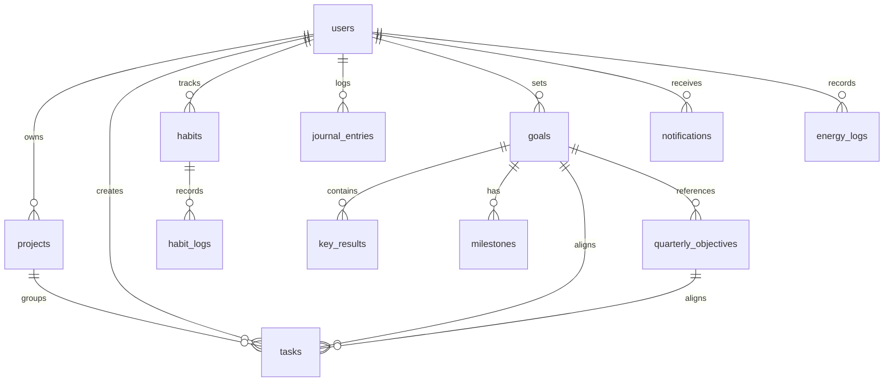

# Database Schema Documentation

This document serves as the schema reference for Evolv's PostgreSQL and SQLite databases, reflecting all applied database migrations up to version 5.

---

## 1. Entity Relationship Overview

The core entities are structured around the **User** as the root owner. The planning layer maps **Tasks** to **Projects**, **Goals**, and **Objectives** to build a cohesive progress hierarchy:

---

## 2. Table Specifications

### 2.1. users
Contains user authentication and settings profile.

| Column | Type | Constraints / Default | Description |
| :--- | :--- | :--- | :--- |
| `id` | `BIGINT` | `PRIMARY KEY`, `AUTOINCREMENT` | Unique identifier. |
| `email` | `TEXT` | `NOT NULL`, `UNIQUE` | User email address. |
| `password_hash`| `TEXT` | `NOT NULL` | bcrypt hashed password. |
| `name` | `TEXT` | `NOT NULL` | Display name. |
| `preferences` | `JSONB` | `NOT NULL DEFAULT '[]'` | JSON preferences configurations. |
| `is_onboarded` | `BOOLEAN`| `NOT NULL DEFAULT FALSE` | Flag for completed onboarding. |
| `created_at` | `TIMESTAMPTZ`| `NOT NULL DEFAULT NOW()` | Record creation timestamp. |
| `updated_at` | `TIMESTAMPTZ`| `NOT NULL DEFAULT NOW()` | Record update timestamp. |
| `deleted_at` | `TIMESTAMPTZ`| `NULL` | Soft delete support. |

---

### 2.2. projects
Represents project containers that group related tasks.

| Column | Type | Constraints / Default | Description |
| :--- | :--- | :--- | :--- |
| `id` | `BIGINT` | `PRIMARY KEY`, `AUTOINCREMENT` | Unique identifier. |
| `user_id` | `BIGINT` | `NOT NULL`, `FOREIGN KEY REFERENCES users(id) ON DELETE CASCADE` | Owner ID. |
| `title` | `TEXT` | `NOT NULL` | Project title. |
| `description` | `TEXT` | `NULL` | Details about the project. |
| `color` | `TEXT` | `NOT NULL DEFAULT '#D2BBFF'` | Theme hexadecimal color. |
| `status` | `TEXT` | `NOT NULL DEFAULT 'active'` | `active`, `archived`, `completed`. |
| `deadline` | `TIMESTAMPTZ`| `NULL` | Optional deadline timestamp. |
| `created_at` | `TIMESTAMPTZ`| `NOT NULL DEFAULT NOW()` | Creation timestamp. |
| `updated_at` | `TIMESTAMPTZ`| `NOT NULL DEFAULT NOW()` | Update timestamp. |
| `deleted_at` | `TIMESTAMPTZ`| `NULL` | Soft delete support. |

---

### 2.3. tasks
Primary workflow model representing action items.

| Column | Type | Constraints / Default | Description |
| :--- | :--- | :--- | :--- |
| `id` | `BIGINT` | `PRIMARY KEY`, `AUTOINCREMENT` | Unique identifier. |
| `user_id` | `BIGINT` | `NOT NULL`, `FOREIGN KEY REFERENCES users(id) ON DELETE CASCADE` | Creator ID. |
| `project_id` | `BIGINT` | `FOREIGN KEY REFERENCES projects(id) ON DELETE SET NULL` | Parent project container. |
| `parent_task_id`| `BIGINT` | `FOREIGN KEY REFERENCES tasks(id) ON DELETE CASCADE` | Nested subtask hierarchy support. |
| `goal_id` | `BIGINT` | `FOREIGN KEY REFERENCES goals(id) ON DELETE SET NULL` | Linked strategic goal. |
| `objective_id` | `BIGINT` | `FOREIGN KEY REFERENCES quarterly_objectives(id) ON DELETE SET NULL` | Linked quarterly planning objective. |
| `title` | `TEXT` | `NOT NULL` | Task description header. |
| `description` | `TEXT` | `NULL` | Longer task notes. |
| `is_completed` | `BOOLEAN` | `NOT NULL DEFAULT FALSE` | Completion state indicator. |
| `priority` | `TEXT` | `NOT NULL DEFAULT 'medium'` | `low`, `medium`, `high`. |
| `due_date` | `TIMESTAMPTZ`| `NULL` | Target completion timestamp. |
| `position` | `INT` | `NOT NULL DEFAULT 0` | Display sorting index. |
| `tags` | `TEXT` | `NOT NULL DEFAULT ''` | Comma-separated labels. |
| `dependencies` | `TEXT` | `NOT NULL DEFAULT ''` | Comma-separated blocking task IDs. |
| `notes` | `TEXT` | `NULL` | Extra task context notes. |
| `is_urgent` | `BOOLEAN` | `NOT NULL DEFAULT FALSE` | Eisenhower Matrix urgency flag. |
| `is_important` | `BOOLEAN` | `NOT NULL DEFAULT FALSE` | Eisenhower Matrix importance flag. |
| `recurrence` | `TEXT` | `NOT NULL DEFAULT ''` | `daily`, `weekly`, `monthly`. |
| `created_at` | `TIMESTAMPTZ`| `NOT NULL DEFAULT NOW()` | Creation timestamp. |
| `updated_at` | `TIMESTAMPTZ`| `NOT NULL DEFAULT NOW()` | Update timestamp. |
| `deleted_at` | `TIMESTAMPTZ`| `NULL` | Soft delete support. |

---

### 2.4. habits
Habit tracking logs.

| Column | Type | Constraints / Default | Description |
| :--- | :--- | :--- | :--- |
| `id` | `BIGINT` | `PRIMARY KEY`, `AUTOINCREMENT` | Unique identifier. |
| `user_id` | `BIGINT` | `NOT NULL`, `FOREIGN KEY REFERENCES users(id) ON DELETE CASCADE` | Owner ID. |
| `stack_after_id`| `BIGINT` | `FOREIGN KEY REFERENCES habits(id) ON DELETE SET NULL` | Habit stacking sequencing linkage. |
| `title` | `TEXT` | `NOT NULL` | Habit outcome description. |
| `description` | `TEXT` | `NULL` | Subtext/Context notes. |
| `frequency` | `TEXT` | `NOT NULL DEFAULT 'daily'` | Recurrence interval configuration. |
| `streak` | `INT` | `NOT NULL DEFAULT 0` | Current consecutive success streak. |
| `category` | `TEXT` | `NOT NULL DEFAULT 'Health'` | Core category/bucket. |
| `routine_type` | `TEXT` | `NOT NULL DEFAULT 'none'` | `morning`, `night`, `none`. |
| `position` | `INT` | `NOT NULL DEFAULT 0` | Display ordering sequence. |
| `streak_shield_active` | `BOOLEAN` | `NOT NULL DEFAULT FALSE` | Flag active shield safety state. |
| `streak_shields_remaining` | `INT` | `NOT NULL DEFAULT 0` | Available shield activation tokens. |
| `created_at` | `TIMESTAMPTZ`| `NOT NULL DEFAULT NOW()` | Creation timestamp. |
| `updated_at` | `TIMESTAMPTZ`| `NOT NULL DEFAULT NOW()` | Update timestamp. |
| `deleted_at` | `TIMESTAMPTZ`| `NULL` | Soft delete support. |

---

### 2.5. habit_logs
History of habit completions.

| Column | Type | Constraints / Default | Description |
| :--- | :--- | :--- | :--- |
| `id` | `BIGINT` | `PRIMARY KEY`, `AUTOINCREMENT` | Unique identifier. |
| `habit_id` | `BIGINT` | `NOT NULL`, `FOREIGN KEY REFERENCES habits(id) ON DELETE CASCADE` | Associated habit ID. |
| `completed_at` | `TIMESTAMPTZ`| `NOT NULL` | Success completion timestamp. |

---

### 2.6. journal_entries
Daily user logging forms.

| Column | Type | Constraints / Default | Description |
| :--- | :--- | :--- | :--- |
| `id` | `BIGINT` | `PRIMARY KEY`, `AUTOINCREMENT` | Unique identifier. |
| `user_id` | `BIGINT` | `NOT NULL`, `FOREIGN KEY REFERENCES users(id) ON DELETE CASCADE` | Creator ID. |
| `date` | `TEXT` | `NOT NULL` | Day string (Format: `YYYY-MM-DD`). |
| `content` | `TEXT` | `NULL` | Standard text content entry. |
| `mood` | `INT` | `NOT NULL DEFAULT 3` | Mood rating (1-5). |
| `energy` | `INT` | `NOT NULL DEFAULT 3` | Energy rating (1-5). |
| `stress` | `INT` | `NOT NULL DEFAULT 3` | Stress level rating (1-5). |
| `confidence` | `INT` | `NOT NULL DEFAULT 3` | Confidence rating (1-5). |
| `gratitude` | `JSONB` | `NOT NULL DEFAULT '[]'` | Array list of gratitude entries. |
| `wins` | `JSONB` | `NOT NULL DEFAULT '[]'` | Array list of daily victories. |
| `lessons` | `JSONB` | `NOT NULL DEFAULT '[]'` | Array list of daily learnings. |
| `sentiment` | `TEXT` | `NULL` | AI-evaluated sentiment analysis. |
| `themes` | `JSONB` | `NOT NULL DEFAULT '[]'` | Array list of AI-extracted themes. |
| `created_at` | `TIMESTAMPTZ`| `NOT NULL DEFAULT NOW()` | Database row timestamp. |
| `updated_at` | `TIMESTAMPTZ`| `NOT NULL DEFAULT NOW()` | Database update timestamp. |
| `deleted_at` | `TIMESTAMPTZ`| `NULL` | Soft delete support. |

---

### 2.7. goals
Long-term measurable objective.

| Column | Type | Constraints / Default | Description |
| :--- | :--- | :--- | :--- |
| `id` | `BIGINT` | `PRIMARY KEY`, `AUTOINCREMENT` | Unique identifier. |
| `user_id` | `BIGINT` | `NOT NULL`, `FOREIGN KEY REFERENCES users(id) ON DELETE CASCADE` | Creator ID. |
| `title` | `TEXT` | `NOT NULL` | Goal title. |
| `description` | `TEXT` | `NULL` | Details about the goal. |
| `priority` | `TEXT` | `NOT NULL DEFAULT 'medium'` | `low`, `medium`, `high`. |
| `due_date` | `TIMESTAMPTZ`| `NULL` | Target completion date. |
| `progress` | `INT` | `NOT NULL DEFAULT 0` | Completion percentage (0-100). |
| `status` | `TEXT` | `NOT NULL DEFAULT 'active'` | `active`, `done`. |
| `created_at` | `TIMESTAMPTZ`| `NOT NULL DEFAULT NOW()` | Creation timestamp. |
| `updated_at` | `TIMESTAMPTZ`| `NOT NULL DEFAULT NOW()` | Update timestamp. |
| `deleted_at` | `TIMESTAMPTZ`| `NULL` | Soft delete support. |

---

### 2.8. milestones
Roadmapped checkpoints linked to Goals.

| Column | Type | Constraints / Default | Description |
| :--- | :--- | :--- | :--- |
| `id` | `BIGINT` | `PRIMARY KEY`, `AUTOINCREMENT` | Unique identifier. |
| `goal_id` | `BIGINT` | `NOT NULL`, `FOREIGN KEY REFERENCES goals(id) ON DELETE CASCADE` | Associated goal. |
| `quarter` | `TEXT` | `NULL` | `Q1`, `Q2`, `Q3`, `Q4`. |
| `date` | `TIMESTAMPTZ`| `NULL` | Scheduled date checkpoint. |
| `title` | `TEXT` | `NOT NULL` | Milestone title. |
| `description` | `TEXT` | `NULL` | Milestone details. |
| `status` | `TEXT` | `NOT NULL DEFAULT 'upcoming'` | `done`, `active`, `upcoming`. |
| `created_at` | `TIMESTAMPTZ`| `NOT NULL DEFAULT NOW()` | Record creation timestamp. |

---

### 2.9. key_results
Granular key results linked to Goals.

| Column | Type | Constraints / Default | Description |
| :--- | :--- | :--- | :--- |
| `id` | `BIGINT` | `PRIMARY KEY`, `AUTOINCREMENT` | Unique identifier. |
| `goal_id` | `BIGINT` | `NOT NULL`, `FOREIGN KEY REFERENCES goals(id) ON DELETE CASCADE` | Associated parent goal. |
| `text` | `TEXT` | `NOT NULL` | Key result description. |
| `is_done` | `BOOLEAN` | `NOT NULL DEFAULT FALSE` | Status flag. |
| `created_at` | `TIMESTAMPTZ`| `NOT NULL DEFAULT NOW()` | Record creation timestamp. |

---

### 2.10. energy_logs
Circadian energy logs.

| Column | Type | Constraints / Default | Description |
| :--- | :--- | :--- | :--- |
| `id` | `BIGINT` | `PRIMARY KEY`, `AUTOINCREMENT` | Unique identifier. |
| `user_id` | `BIGINT` | `NOT NULL`, `FOREIGN KEY REFERENCES users(id) ON DELETE CASCADE` | Logger ID. |
| `logged_at` | `TIMESTAMPTZ`| `NOT NULL DEFAULT NOW()` | Exact timestamp of entry. |
| `energy` | `INT` | `NOT NULL` | Rated energy level (1-5). |

---

### 2.11. notifications
In-app notification system.

| Column | Type | Constraints / Default | Description |
| :--- | :--- | :--- | :--- |
| `id` | `BIGINT` | `PRIMARY KEY`, `AUTOINCREMENT` | Unique identifier. |
| `user_id` | `BIGINT` | `NOT NULL`, `FOREIGN KEY REFERENCES users(id) ON DELETE CASCADE` | Target User ID. |
| `title` | `TEXT` | `NOT NULL` | Notification header title. |
| `message` | `TEXT` | `NOT NULL` | Long message body. |
| `type` | `TEXT` | `NOT NULL DEFAULT 'info'` | Alert level (e.g. `info`, `habit_shield`). |
| `is_read` | `BOOLEAN` | `NOT NULL DEFAULT FALSE` | Flag for read state. |
| `created_at` | `TIMESTAMPTZ`| `NOT NULL DEFAULT NOW()` | Creation timestamp. |
